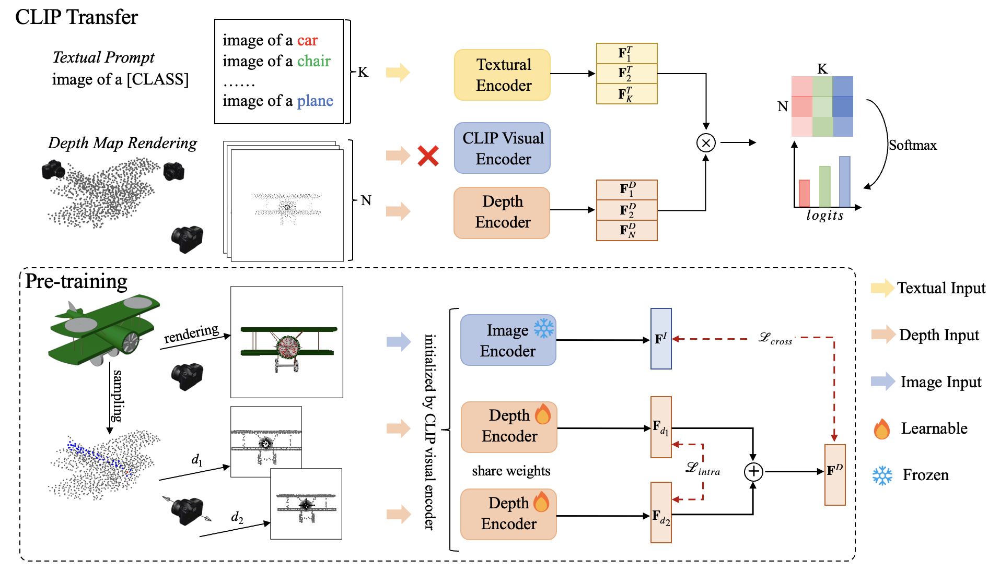

# CLIP2Point
This repo is the official implementation of ["CLIP2Point: Transfer CLIP to Point Cloud Classification with Image-Depth Pre-training"](https://arxiv.org/abs/2210.01055)

## Introduction
CLIP2Point is an image-depth pre-training method by contrastive learning to transfer CLIP to the 3D domain, and is then adapted to point cloud classification. We introduce a new depth rendering setting that forms a better visual effect, and then render 52,460 pairs of images and depth maps from ShapeNet for pre-training. The pre-training scheme of CLIP2Point combines cross-modality learning to enforce the depth features for capturing expressive visual and textual features and intra-modality learning to enhance the invariance of depth aggregation. Additionally, we propose a novel Dual-Path Adapter (DPA) module, i.e., a dual-path structure with simplified adapters for few-shot learning. The dual-path structure allows the joint use of CLIP and CLIP2Point, and the simplified adapter can well fit few-shot tasks without post-search. Experimental results show that CLIP2Point is effective in transferring CLIP knowledge to 3D vision. Our CLIP2Point outperforms PointCLIP and other self-supervised 3D networks, achieving state-of-the-art results on zero-shot and few-shot classification.



## Requirements
### Installation
PyTorch, PyTorch3d, CLIP, pointnet2_ops, etc., are required. We recommend to create a conda environment and install dependencies in Linux as follows:
```shell
# create a conda environment
conda create -n clip2point python=3.7 -y
conda activate clip2point

# install pytorch & pytorch3d
conda install pytorch==1.11.0 torchvision==0.12.0 torchaudio==0.11.0 cudatoolkit=11.3 -c pytorch
conda install -c fvcore -c iopath -c conda-forge fvcore iopath
conda install -c bottler nvidiacub
conda install pytorch3d -c pytorch3d
pip install "git+https://github.com/facebookresearch/pytorch3d.git"

# install CLIP
pip install ftfy regex tqdm
pip install git+https://github.com/openai/CLIP.git

# install pointnet2 & other packages
pip install "git+https://github.com/erikwijmans/Pointnet2_PyTorch.git#egg=pointnet2_ops&subdirectory=pointnet2_ops_lib"
pip install -r requirements.txt
```

### Data preparation
The overall directory structure should be:

```
│CLIP2Point/
├──datasets/
├──data/
│   ├──ModelNet40_Align/
│   ├──ModelNet40_Ply/
│   ├──Rendering/
│   ├──ShapeNet55/
│   ......
├──.......
```
For pre-training, we use **Rendering** and **ShapeNet55**, which respectively provide rendered images and point cloud data. We provide [**Rendering**](https://drive.google.com/file/d/1jMuYi4IoM6A80uPCohjGkNP6pLP1-0Gm/view?usp=sharing), and you can refer to [Point-BERT](https://github.com/lulutang0608/Point-BERT/blob/master/DATASET.md) for **ShapeNet55**.

For downstream classification, we use [**ModelNet40_Align**](https://github.com/lmb-freiburg/orion). As we randomly sample points from .off file, results of this dataset can be better or worse than the results we claimed. Thus, we further save and provide the sampled point cloud data in our training process, namely [**ModelNet40_Ply**](https://drive.google.com/file/d/1nEJYZ9QPBgYPMiVCJGKWY6pVaJmPxVRq/view?usp=sharing). Note that our claimed results are possibly not the best results, but a best result in our training process. You can use **ModelNet40_Align** to find a better result, or simply infernce our pre-trained weights with **ModelNet40_Ply**.


## Get stared
We have several config options in training and evaluation, you can follow our settings, or modify some of them to satisfy your requirements. We provide the pre-trained checkpoint [best_eval.pth](https://drive.google.com/file/d/1ZAnIANNMqRRRmaVtk8Kp93s_NkGU51zv/view?usp=sharing) and few-shot checkpoint [best_test.pth](https://drive.google.com/file/d/1Jr1yXOu1yKmMs8K7XD8FnttPRHnZOZHx/view?usp=sharing)
### Pre-training
If you want to pre-train a depth encoder, and then save the logs and checkpoints at ./pre_results/vit32/,
```
python pretraining.py --exp_name vit32
```
### Zero-shot Classification
If you want to evaluate zero-shot CLIP visual encoder,
```
python zeroshot.py
```
or you can use the checkpoint,
```
python zeroshot.py --ckpt [pre-trained_ckpt_path]
```
### Few-shot Classification
If you want to train a Dual-Path Adapter (DPA) for few-shot classification and save the logs and checkpoints at ./exp_results/dpa/,
```
python fewshot.py --exp_name dpa --ckpt [pre-trained_ckpt_path]
```
or simply evaluate it with the few-shot training checkpoint,
```
python fewshot.py --eval --ckpt [trained_ckpt_path]
```


## Acknowledgement
Our codes are built on [CLIP](https://github.com/openai/CLIP), [MVTN](https://github.com/ajhamdi/MVTN), and [CrossPoint](https://github.com/MohamedAfham/CrossPoint).

## Citation
```
@article{huang2022clip2point,
  title={CLIP2Point: Transfer CLIP to Point Cloud Classification with Image-Depth Pre-training},
  author={Huang, Tianyu and Dong, Bowen and Yang, Yunhan and Huang, Xiaoshui and Lau, Rynson WH and Ouyang, Wanli and Zuo, Wangmeng},
  journal={arXiv preprint arXiv:2210.01055},
  year={2022}
}
```
